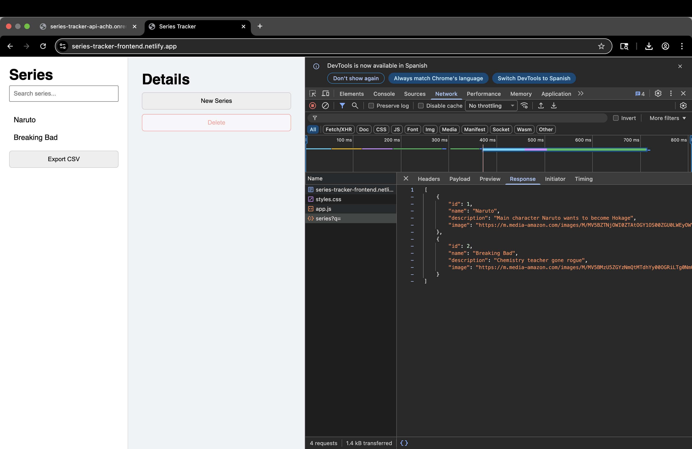

# Series Tracker Backend

REST API for managing TV series. Returns data in JSON format and is consumed by a separate client.

---

## Live Demo

Frontend: https://series-tracker-frontend.netlify.app/

Backend: https://series-tracker-api-achb.onrender.com

---

## Technologies

- Go (net/http)
- PostgreSQL

---

## How to run the project

1. Clone the repository
2. Make sure PostgreSQL is running
3. Create the database table:

```sql
CREATE TABLE series (
    id SERIAL PRIMARY KEY,
    name TEXT NOT NULL,
    description TEXT,
    image TEXT
);
```

4. Run the server:

```bash
go run cmd/main.go
```
The server runs at
```bash
http://localhost:3000
```
---

## Endpoints
### GET /series

Returns all series

**Optional query parameters:**

`q` -> search by name
`sort` -> field (id, name)
`order` -> `asc` or `desc`

### GET /series/:id

Returns a series by id

### POST /series

Creates a new series

Request body:

```json
{
  "name": "Dark",
  "description": "Time travel",
  "image": "url"
}
```

### PUT /series/:id

Updates existing series

### DELETE /series/:id

Deletes a series

---

## Project Structure

```text
.
├── cmd/
│   └── main.go
├── internal/
│   ├── db/
│   │   └── db.go
│   ├── handlers/
│   │   └── series.go
│   └── models/
│       └── series.go
├── screenshot.png
├── go.mod
├── go.sum
├── .gitignore
└── README.md
```

---

## CORS

CORS is a browser security policy that restricts requests between different origins.

The server is configured to allow all origins during development using:

`Access-Control-Allow-Origin: *`

---

## Implemented Features / Challenges

- Full CRUD operations
- Search by name (`?q=`)
- Sorting (`?sort`, `?order`)
- Proper HTTP methods and status codes
- Server-side validation
- CORS configuration

---

## Screenshot

API response example:



---

## Reflection

This project helped me understand how to design and implement a REST API using Go. I learned how to properly handle HTTP methods, status codes, and JSON responses, as well as how to connect and interact with a PostgreSQL database.

Working on the backend reinforced client and server relationship, and how proper validation and error handling improve reliability. I would use this approach again because it provides a clean and scalable architecture for building web applications.

---

## Status

The API is fully functional and ready to be consumed by external clients.

---


